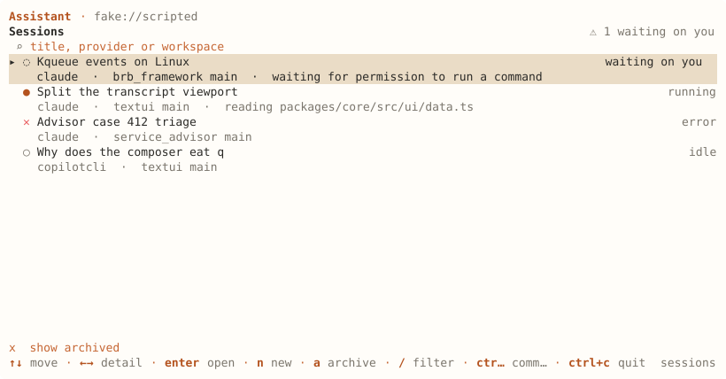
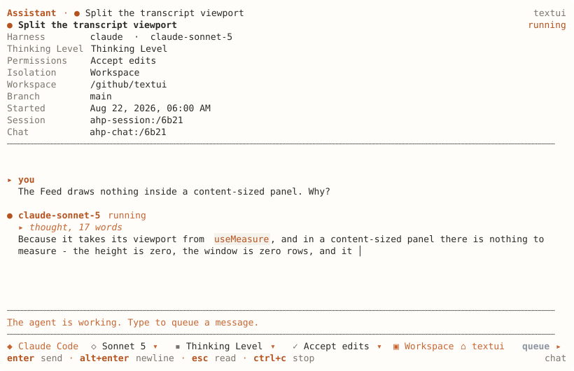

# ahpc

[](https://github.com/softov/ahpc/actions/workflows/ci.yml)
[](https://www.npmjs.com/package/@softov/ahpc)


A terminal client for the [Agent Host Protocol](https://microsoft.github.io/agent-host-protocol/).
It can be used as cli (commands), tui (interactive chat), or a tool server that lets an agent elsewhere drive the sessions on your host.

Connect to an AHP host, manage sessions, and work with agents directly from your terminal.

> [!NOTE]
> `ahpc` is a client. It does not run agents or models itself.
> You need an AHP-compatible host to connect to.

The interface is built with [TextUI](https://github.com/softov/textui), a component toolkit for terminal applications.

## Quick start

```sh
npm install -g @softov/ahpc
```

Or run it without installing, with `npx @softov/ahpc`.

The package is scoped; the command it installs is `ahpc`.

A scripted host is built in, so the screen runs with nothing else to set up:

```sh
ahpc
```

Point it at a real host:

```sh
ahpc --host ws://127.0.0.1:9187
ahpc session list --host ws://127.0.0.1:9187
```

[`ahpd`](https://github.com/softov/ahpd) and VS Code's agent host are both AHP hosts.

## What it does

| | |
|---|---|
| Sessions | List, create, configure, archive and delete sessions on a host. |
| Turns | Send a prompt, stream the reply, queue follow-ups, cancel. |
| Answering | Approve or deny tool calls, and answer questions the agent asks mid-turn. |
| Chats | Multiple conversations in one session. |
| Changes and files | Files a session changed, their diffs, and the host's filesystem. |
| Terminals | Shells running on the host, and their output. |
| Automations | Scheduled and triggered runs, with their history. |
| Customizations | Skills, prompts, agents and MCP servers, and which are enabled. |
| Telemetry | Stream the host's log. |
| Tool server | Serve those sessions to an agent somewhere else, over MCP or a plain JSON API. |

## Interactive

`ahpc` with no command opens the screen.



The list shows every session on the host: its status, the agent, the workspace and branch, and what it is doing right now. Sessions waiting on you are counted at the top. `ctrl+f` filters by title, agent or workspace, and `x` shows the archived ones with a count of how many that is.



Inside a session, the header shows the model, thinking level, permission mode, workspace and branch. All of it comes from the host, not from local guesses.

`ctrl+f` opens a find box in the top right. Type and the term is coloured wherever it appears; `enter` and `down` go to the next one, `up` to the one before, and both wrap. The box says which match you are on and how many there are.


Before the first message, a new session asks the agent, the model and its options, the permission mode and the workspace. The workspace is picked by looking: the chip opens a folder dialog over the host's own directories (`resourceList`, the same request VS Code's folder picker makes), starting where the chip points when the host will list that and in a directory some session is in otherwise; `Workspace path` in the palette still takes one typed, for a served directory the dialog cannot walk to. The questions come from the host's `configSchema`, so options `ahpc` has never seen still get a chip. Two rows under the field: what runs on the first, and where it runs on the second - the directory, in place or in a worktree of it, and the branch a worktree starts from. What the host marks `readOnly` is shown and not asked, and the worktree seeds the reference client never draws (`worktreeBranchPrefix`, `worktreeCreateNewBranch`, `worktreeBranchTrack`, `worktreeIncludeFiles`, `shellInitScripts`) are not drawn here either.

### Keys

| Key | |
|---|---|
| `enter` | Send |
| `alt+enter` | Newline |
| `tab` | Move through the option rows |
| `esc` | Close the menu, then leave the field, then go back. On an option, back to the field |
| `/` | Slash commands, from the host and from `ahpc` — `/config` opens the settings palette |
| `@` | Complete a file path on the host |
| `ctrl+g` | Edit the message in `$VISUAL` or `$EDITOR` |
| `ctrl+p` | Command palette |
| `f1` | Every key that works where you are |
| `ctrl+f` | Filter the session list, or find in the open conversation |
| `l` | Follow an `agent-host-session://` link in the open conversation: the links the agent's session tools answered with, as a list, and one chosen opens the session or the chat it names. `--session` and every `<uri>` on the command line take a link too |
| `ctrl+n` | New session |
| `ctrl+r` | Refresh |
| `alt+t` | Theme |
| `alt+m` | Markdown on or off |
| `ctrl+c` | Cancel the running turn, or quit |

Editing in the composer follows readline:

| Key | |
|---|---|
| `ctrl+a` / `ctrl+e` | Start or end of the line |
| `ctrl+k` / `ctrl+u` | Delete to the end, or to the start |
| `ctrl+w`, `alt+backspace` | Delete the word before the caret |
| `alt+d` | Delete the word after it |
| `ctrl+z` / `alt+z` | Undo, redo |
| `ctrl+←` / `ctrl+→` | Move a word at a time |

Undo groups a run of typing into one step, so it takes back a word rather than a character.

When a tool call is waiting: `a` approves, `d` denies, `1`-`9` pick an offered option. When the agent asks a question: `tab` moves between fields, `space` selects, `enter` sends.

## Commands

`ahpc <command>` runs without the screen. Output is formatted for reading; `--json` gives the same data for scripts.

### Sessions

| Command | | |
|---|---|---|
| `session list` | List sessions, newest first | `--archived` `--json` |
| `session show <uri>` | Session details | `--full` `--json` |
| `session new` | Create a new session | `--agent` `--cwd` `--set k=v` `--json` |
| `session rm <uri>` | Delete a session | |
| `session read <uri>` | Mark as read | `--unread` |
| `session archive <uri>` | Archive a session | `--undo` |
| `session history <uri>` | Show turns history | `--all` `--full` `--json` |
| `session config <uri>` | Show the config schema and current values | `--json` |
| `session set <uri> <k> <v>` | Change one config property | |
| `session customizations <uri>` | List skills, prompts, agents and MCP servers | `--json` |
| `session toggle <uri> <id>` | Toggle customization on/off | `--off` |
| `session export <uri>` | Export the session as one document | `--json` `--markdown` |

### Turns

| Command | | |
|---|---|---|
| `prompt <uri> <text>` | Send a prompt and stream the reply | `--model` `--json` |
| `exec <text>` | Run one prompt in a throwaway session | `--agent` `--cwd` `--model` `--json` |
| `cancel <uri>` | Cancel the running turn | |
| `queue <uri> <text>` | Queue a prompt behind the running turn | `--model` |
| `unqueue <uri> <id>` | Remove a queued prompt | |

### Answering

| Command | | |
|---|---|---|
| `watch <uri>` | Block until the agent needs input, print it, exit | `--until turn\|input\|idle` `--timeout` `--json` |
| `confirm <uri> <toolCallId>` | Approve a tool call | `--deny` `--option` |
| `answer <uri> <requestId>` | Answer a question | `--field k=v` `--reject` |

### Chats

| Command | | |
|---|---|---|
| `chat list <uri>` | List the chats in a session | `--json` |
| `chat new <uri> [text]` | Start another chat | |
| `chat rm <chatUri>` | Close a chat | |

### The host

| Command | | |
|---|---|---|
| `agents` | List the agents the host serves, with their models | `--json` |
| `models` | List every model, grouped by agent | `--json` |
| `commands` | List the slash commands the host offers | `--json` |
| `customizations` | List skills, prompts, agents and MCP servers | `--kind` `--json` |
| `completions <uri> <text>` | Show what the host would complete | `--offset` `--json` |
| `logs` | Stream the host's log | `--level` `--follow` |
| `auth` | List the resources this host protects | `--json` |
| `auth <resource>` | Send a token for one | `--token` `--expires-in` |
| `status` | Show the current connection, and whether a newer `ahpc` is on npm | `--json` |

### Changes and files

| Command | | |
|---|---|---|
| `changes <uri>` | List the files a session changed | `--list` `--scope` `--reviewed` `--unreviewed` `--operations` `--run` `--json` |
| `content <uri> <file>` | Print one changed file in full | |
| `resource list <uri>` | List a directory on the host | `--json` |
| `resource read <uri>` | Read a file on the host | |
| `resource stat <uri>` | Show a file's type and size | `--json` |
| `resource write <uri> [file]` | Write a file, from a path or stdin | `--create-only` `--force` |
| `resource rm <uri>` | Delete a file or directory | `--recursive` |
| `resource mkdir <uri>` | Create a directory | |
| `resource mv <uri> <to>` | Move or rename | `--fail-if-exists` |
| `resource cp <uri> <to>` | Copy | `--fail-if-exists` |

Writes are guarded by the file's etag unless you pass `--force`, so two clients editing the same file cannot silently overwrite each other.

### Terminals

| Command | | |
|---|---|---|
| `terminal list` | List running terminals | `--json` |
| `terminal new` | Open a shell | `--cwd` `--name` |
| `terminal rm <uri>` | Close a terminal | |
| `terminal send <uri> <text>` | Send input to a terminal | |
| `terminal watch <uri>` | Follow a terminal's output | `--timeout` |

### Automations

| Command | | |
|---|---|---|
| `automation list` | List automations | `--json` |
| `automation show <uri>` | Show one automation | `--json` |
| `automation triggers` | List the triggers this host supports | `--json` |
| `automation runs <uri>` | Show an automation's run history | `--json` |
| `automation run <uri>` | Run it now | |
| `automation enable <uri>` / `disable <uri>` | Enable or disable it | |
| `automation rm <uri>` | Delete it | |

### Serving these sessions to something else

| Command | | |
|---|---|---|
| `mcp` | MCP on stdin and stdout, for a client that launches this process | `--mcp-tools G,…` |
| `serve` | The same tools on a socket, shared | `--serve-host H` `--serve-port N` `--serve-token T` `--serve-origin URL` `--mcp-tools G,…` |

### Anything else

| Command | | |
|---|---|---|
| `dispatch <uri> <type>` | Send a raw protocol action | `--field k=v` `--chat` |
| `wire <file>` | Watch a `--wire` capture as it is written, from either end: one row per frame, a row opens to the frame. Off a terminal, one line per frame | `--follow` `--filter text` `--json` |
| `config` | Show the config file path and current values | `--json` |
| `--version` | What version this is | |
| `help` | Print this command list | |

## As a tool server

The other direction: an agent somewhere else driving the sessions on your host, through this client. Twelve tools - list, create and dispose a session, read its transcript, say something and wait for the answer, and answer what the agent stops to ask.

`ahpc mcp` speaks MCP on stdin and stdout, which is what an MCP client that launches the process expects:

```json
{
  "mcpServers": {
    "ahp": { "command": "ahpc", "args": ["--host", "ws://127.0.0.1:9187", "mcp"] }
  }
}
```

`ahpc serve` is the same twelve tools on a socket that several callers share, and it stays up until it is stopped:

```sh
ahpc --host ws://127.0.0.1:9187 serve --serve-port 7431
```

`POST /mcp` is MCP for a client that speaks it. `POST /api/<tool>` is the same tool with the arguments as the body and the answer as the body, for everything that is not one - a shell script, a webhook, a program in another language. `GET /api` lists what there is.

```sh
curl -XPOST localhost:7431/api/new_session -d '{"workingDirectory":"/work"}'
curl -XPOST localhost:7431/api/send_turn -d '{"session":"claude:/…","text":"what is in this directory"}'
```

### More than the twelve

Files, terminals, automations and changesets are there too, one group at a time, and off unless asked for. That is on purpose: a tool table is read by a model alongside everything else it was given, and thirty tools is a worse server than twelve for the thing almost everybody wants, which is driving a session.

```sh
ahpc --host ws://127.0.0.1:9187 mcp --mcp-tools resources,changes
```

| Group | Tools |
|---|---|
| `resources` | `list_directory` `read_file` `write_file` `make_directory` `delete_path` `move_path` `copy_path` |
| `terminals` | `list_terminals` `new_terminal` `send_to_terminal` `read_terminal` `dispose_terminal` |
| `automations` | `list_automations` `run_automation` `set_automation_enabled` `remove_automation` |
| `changes` | `list_changesets` `show_changes` |

Repeatable as well as comma-separated. It is `--mcp-tools` rather than `--tools` because every other flag on this client is an AHP thing, and a bare `--tools` would read like it was choosing which tools the *agent* may call - a different question with a different answer.

Calling a tool from a group nobody turned on is refused with the flag that would turn it on, rather than with "no such tool", because those are different problems and only the person who started the server can fix the first.

Writing needs the host to have granted write access to that directory, and a host that has not refuses with `-32009` saying so. That is not something this client can grant on a model's behalf: it is the same question a person answers before a session may edit their repository.

`read_file` and `write_file` take a `file://` URI on the *host*, not a path on the machine running `ahpc` - the two may not be the same machine. `write_file` reads the file's etag first and refuses a write if it changed in between, unless passed `force`; a model reading a file, thinking, and writing it back is a read-modify-write with a person editing in the middle of it.

`send_turn` blocks until the turn ends and returns what the agent said. A turn that stops to ask a person something is not finished: `wait_for_attention` says what it wants, and `confirm_tool_call` and `answer_question` answer it.

A caller that does not want to sit in silence for a minute puts a `progressToken` in the request's `_meta`, and gets a `notifications/progress` line for each tool the agent reaches for. On `serve` that also decides the shape of the reply: asked for, the POST is answered with an SSE stream carrying the notifications and then the result; not asked for, it is one JSON object. MCP has no shape for streaming partial *result* content, so the reply itself still arrives whole at the end - what this fixes is an agent that looked frozen, not one you want to watch write.

It binds to `127.0.0.1` unless told otherwise, because anybody who can reach the port can drive every session on the host. `--serve-token` sets a bearer token, which is what makes `--serve-host 0.0.0.0` defensible.

Requests carrying a browser `Origin` are refused unless the origin is this server's own or was named with `--serve-origin`, repeatable. That is the transport's own rule and it is not paranoia: loopback is not the protection it looks like, because a page on any site can POST to `127.0.0.1` from inside the browser of the person running this, and the request arrives from their own machine. A program - a script, a webhook, an MCP client - sends no `Origin` and is let through.

## AHP support

All 30 client-to-server requests are implemented, and 21 of the 45 client-dispatchable actions are used. `ahpc` subscribes to the root, session, chat, terminal and automation channels, plus the telemetry channel the host advertises for its log.

AHP is symmetrical, so a host can also request things from the client. Nine of the ten server-initiated methods are implemented; `createResourceWatch` is not. Nothing is shared until `--publish <dir>` names a directory, and it stays read-only without `--publish-writable`:

```sh
ahpc --host ws://127.0.0.1:9187 --publish ~/notes
```

The host reads those files at `virtual://<clientId>/<path>`. Publishing lasts only while the screen is open.

[docs/CONFORMANCE.md](docs/CONFORMANCE.md) covers the full surface: which actions are dispatched, four divergences and why, undeclared fields hosts send in practice, and three defects that belong to the protocol package rather than any implementation.

## Configuration

`$XDG_CONFIG_HOME/ahpc/config.json`, or `~/.config/ahpc/config.json`:

```json
{ "host": "ws://127.0.0.1:9187", "theme": "paper-light" }
```

Precedence: a flag overrides an environment variable, which overrides the file.

| | |
|---|---|
| `--host`, `AHPC_HOST` | The host to connect to |
| `--token`, `AHPC_TOKEN` | A bearer token for it |
| `AHPC_TOKEN_<RESOURCE>` | A token for one protected resource |
| `--config-file` | Read this file instead |
| `--no-update-check`, `updateCheck: false` | Never ask npm whether a newer version exists. See below |

`ahpc config` prints the file path and the values in force. It works without a host, which is what you need when the host is the problem.

### Knowing when it is old

The screen asks npm, six hours apart, whether a newer `@softov/ahpc` exists, and writes the answer to `update.json` beside the configuration. When there is one, the status row says `@softov/ahpc 0.5.0 is on npm, this is 0.4.0` in place of the key hints, and `ahpc status` prints the same sentence as a third line (`update: { latest }` under `--json`). Nothing waits on the network: the row is what the file said last time, the request goes out in the background after the screen is up and the row is read again when it lands, and a fresh install says nothing on its first run because there is no file yet. The request is `GET <registry>/-/package/@softov/ahpc/dist-tags`, eighteen bytes, against `npm_config_registry` when that is set and `registry.npmjs.org` otherwise, so a mirror is not reached past. Every failure is silence, offline or a registry that is down alike, because none of them is something to act on from here.

Off with `--no-update-check`, with `NO_UPDATE_NOTIFIER` or `CI` set to anything, or with `"updateCheck": false` in the file. A still (`--static`) or a piped run draws or prints what the file says and never asks.

### Keys

`keys` maps a chord to a command id, or to `null` to unbind it:

```json
{
  "keys": {
    "ctrl+g": "editor.open",
    "ctrl+t": null,
    "ctrl+y": "session.new"
  }
}
```

Naming a chord replaces every default on it, so a chord is either yours or the client's and never half of each. A chord bound to a name no command answers to is reported at startup rather than ignored. `ctrl+c`, `ctrl+d`, `ctrl+h`, `ctrl+i`, `ctrl+j`, `ctrl+m` and `ctrl+[` cannot be rebound usefully — a terminal sends them as interrupt, end-of-file, backspace, tab, newline, return and escape.

## Development

The layout, the checks and how a release is published are in [DEVELOPER.md](DEVELOPER.md).

```sh
git clone https://github.com/softov/ahpc
cd ahpc
npm install

npm test
npm run typecheck
npm run build      # dist/src, which is what the package ships
```

Two tools check the client against the protocol itself:

```sh
npm run schema              # a strict JSON Schema from the package's own declarations
npm run wire -- <capture>   # check a recording against it
```

`--wire <file>` (or `AHPC_RECORD=<file>`) appends every frame sent and received as one JSON line each, `{ at, from, peer, frame }`, the lines `ahpd --wire` writes, so a capture from either end reads the same and `jq` reads both. `ahpc wire <file>` watches one as it is written: a row per frame with the time, the direction, the method or action type and the channel, a filter over all of them, and the frame itself beside the list or, on a narrow terminal, under enter. Reading the host's capture and this client's side by side is what it is for. `test/conformance.test.ts` runs the same check against frames produced by the test run itself, so it cannot pass on a stale recording.

The screens, widgets and input handling come from [TextUI](https://github.com/softov/textui) — `@textui/core` for components and state, `@textui/widgets` for the catalog, `@textui/terminal` for rendering and key decoding, and `@textui/testing` for the harness the tests run in. `ahpc` began as an example inside it.

[docs/DESIGN.md](docs/DESIGN.md) covers why the client is built this way: how a terminal handles a transcript differently from a browser, and what the widget catalog was missing.

## License

MIT.
