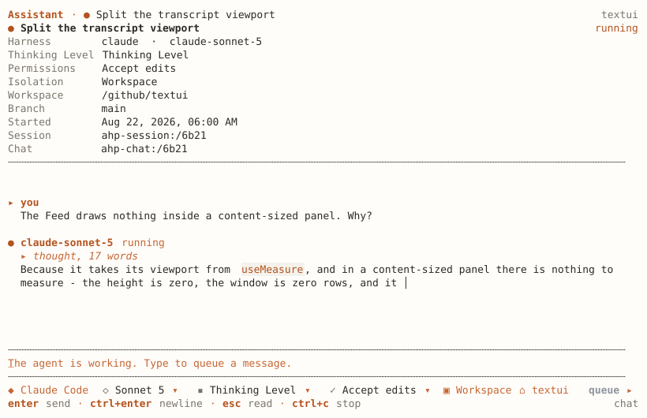
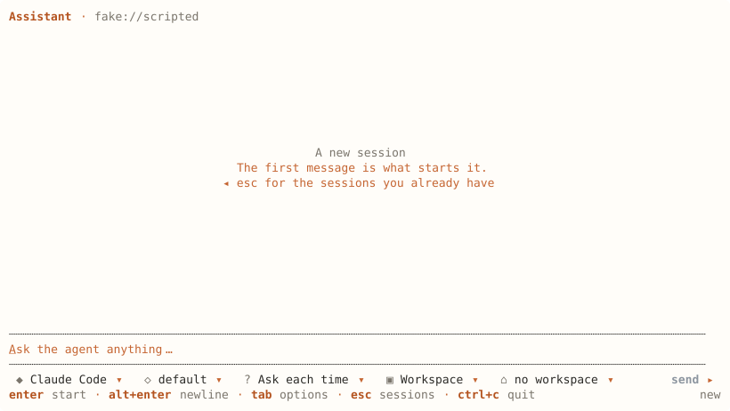

# ahpc

A terminal client for the [Agent Host Protocol](https://microsoft.github.io/agent-host-protocol/).
It can be used as cli (commands) or tui (interactive chat).

Connect to an AHP host, manage sessions, and work with agents directly from your terminal.

> [!NOTE]
> `ahpc` is a client. It does not run agents or models itself.
> You need an AHP-compatible host to connect to.

## Quick start

```sh
git clone https://github.com/softov/ahpc
cd ahpc
npm install && npm run build
```

A scripted host is built in, so the screen runs with nothing else installed:

```sh
node dist/src/main.js
```

Point it at a real host to do work:

```sh
node dist/src/main.js --host ws://127.0.0.1:9187
node dist/src/main.js session list --host ws://127.0.0.1:9187
```

[`ahpd`](https://github.com/softov/ahpd) is one such host. VS Code's agent host is another.

## What it does

| | |
|---|---|
| Sessions | List, open, create, configure, archive and dispose the sessions a host holds. |
| Turns | Send a prompt and stream the answer, queue one behind a running turn, cancel. |
| Answering | Approve or deny a tool call, and answer a question the agent asks mid-turn. |
| Chats | Several conversations inside one session. |
| Changes and files | The files a session touched, their diffs, and the host's own filesystem. |
| Terminals | Shells the host is running, and their output. |
| Automations | What the host runs on its own, its triggers and its run history. |
| Customizations | Skills, prompts, agents and MCP servers, with the ones you want switched on. |
| Telemetry | The host's log, streamed. |

## Interactive

`ahpc` with no command opens the screen.



The header carries what the turn will cost you: which model, its thinking level, the permission mode, the workspace and the branch. Every one of those is what the host reported rather than what this client assumed.



A new session asks the host's own questions before the first message — the agent, the model and its options, the permission mode and the workspace. Which questions appear is the host's `configSchema`, so a host offering something this client has never heard of still gets a row.

### Keys

| Key | |
|---|---|
| `enter` | Send |
| `alt+enter` | Newline |
| `tab` | The options row |
| `esc` | Back, or to the sessions you already have |
| `/` | Commands the host offers, and this client's own |
| `@` | Complete a path on the host |
| `ctrl+p` | The command palette |
| `ctrl+n` | New session |
| `ctrl+r` | Refresh |
| `alt+t` | Theme |
| `alt+m` | Markdown on or off |
| `ctrl+c` | Stop the running turn, or quit |

A tool call waiting on you takes `a` to approve, `d` to deny and `1`-`9` for an option it offered. A question takes `tab` between fields, `space` to choose and `enter` to send.

## Commands

`ahpc <command>` runs without the screen. Output is for reading; `--json` is the same answer for a program.

### Sessions

| Command | | |
|---|---|---|
| `session list` | The catalogue, newest first | `--archived` `--json` |
| `session show <uri>` | What the host says about one | `--full` `--json` |
| `session new` | Start one | `--agent` `--cwd` `--set k=v` `--json` |
| `session rm <uri>` | Dispose it | |
| `session history <uri>` | Its turns | `--all` `--full` `--json` |
| `session config <uri>` | The schema, and what is in force | `--json` |
| `session set <uri> <k> <v>` | Change one config key | |
| `session read <uri>` | Mark read | `--unread` |
| `session archive <uri>` | Put it away | `--undo` |
| `session customizations <uri>` | Skills, prompts, agents, servers | `--json` |
| `session export <uri>` | The whole session as one document | `--json` `--markdown` |
| `session toggle <uri> <id>` | Turn one on | `--off` |

### Turns

| Command | | |
|---|---|---|
| `prompt <uri> <text>` | Say it and stream the answer | `--model` `--json` |
| `exec <text>` | A session, one turn, and dispose it | `--agent` `--cwd` `--model` `--json` |
| `cancel <uri>` | Stop the running turn | |
| `queue <uri> <text>` | Say it after the one running | `--model` |
| `unqueue <uri> <id>` | Take it back | |

### Answering

| Command | | |
|---|---|---|
| `watch <uri>` | Block until something wants a person, print, exit | `--until turn\|input\|idle` `--timeout` `--json` |
| `confirm <uri> <toolCallId>` | Approve a tool call | `--deny` `--option` |
| `answer <uri> <requestId>` | Answer a question | `--field k=v` `--reject` |

### Chats

| Command | | |
|---|---|---|
| `chat list <uri>` | The conversations in a session | `--json` |
| `chat new <uri> [text]` | Another one beside it | |
| `chat rm <chatUri>` | Close one | |

### The host

| Command | | |
|---|---|---|
| `agents` | What it serves, and each one's models | `--json` |
| `models` | Every model, by agent | `--json` |
| `commands` | What a slash offers | `--json` |
| `customizations` | Skills, prompts, agents and MCP servers | `--kind` `--json` |
| `completions <uri> <text>` | What the host would complete | `--offset` `--json` |
| `logs` | What the host is saying | `--level` `--follow` |
| `auth` | What this host protects | `--json` |
| `auth <resource>` | Push a token | `--token` `--expires-in` |
| `status` | What this client is connected to | `--json` |

### Changes and files

| Command | | |
|---|---|---|
| `changes <uri>` | The files a session touched | `--list` `--scope` `--reviewed` `--unreviewed` `--operations` `--run` `--json` |
| `content <uri> <file>` | One of them, in full | |
| `resource list <uri>` | A directory the host serves | `--json` |
| `resource read <uri>` | A file on the host | |
| `resource stat <uri>` | What it is, without reading it | `--json` |
| `resource write <uri> [file]` | From a file, or from stdin | `--create-only` `--force` |
| `resource rm <uri>` | Delete it | `--recursive` |
| `resource mkdir <uri>` | Make a directory | |
| `resource mv <uri> <to>` | Move it | `--fail-if-exists` |
| `resource cp <uri> <to>` | Copy it | `--fail-if-exists` |

A write is guarded by the file's etag unless `--force`, so two clients editing one file do not silently overwrite each other.

### Terminals

| Command | | |
|---|---|---|
| `terminal list` | What is running | `--json` |
| `terminal new` | Open a shell | `--cwd` `--name` |
| `terminal rm <uri>` | Kill it | |
| `terminal send <uri> <text>` | Type into it | |
| `terminal watch <uri>` | Follow its output | `--timeout` |

### Automations

| Command | | |
|---|---|---|
| `automation list` | What runs on its own | `--json` |
| `automation show <uri>` | One of them | `--json` |
| `automation triggers` | What this host can trigger on | `--json` |
| `automation runs <uri>` | Its history, every page | `--json` |
| `automation run <uri>` | Start it now | |
| `automation enable <uri>` / `disable <uri>` | Switch it | |
| `automation rm <uri>` | Forget it | |

### Anything else

| Command | | |
|---|---|---|
| `dispatch <uri> <type>` | Send one action verbatim | `--field k=v` `--chat` |
| `config` | Where the config file is, and what is in force | `--json` |
| `help` | The list above | |

## AHP support

All 30 client-to-server requests are reachable, and 21 of the 45 client-dispatchable actions are dispatched. The channels this client subscribes to are the root, session, chat, terminal and automation ones, plus the telemetry channel the host advertises for its log.

AHP is symmetrical, so a host may ask this client for things too. Nine of the ten server-initiated methods are answered; `createResourceWatch` is not. Nothing is served until `--publish <dir>` names a directory, and it is read-only until `--publish-writable`:

```sh
node dist/src/main.js --host ws://127.0.0.1:9187 --publish ~/notes
```

The host then reads those files at `virtual://<clientId>/<path>`. Serving lasts as long as the screen does.

[docs/CONFORMANCE.md](docs/CONFORMANCE.md) has the whole surface: which actions are dispatched and which are not, four divergences and the reason for each, the fields hosts send that no version of the protocol declares, and three findings that belong to the protocol package rather than to any implementation.

## Configuration

`$XDG_CONFIG_HOME/ahpc/config.json`, or `~/.config/ahpc/config.json`:

```json
{ "host": "ws://127.0.0.1:9187", "theme": "paper-light" }
```

A flag beats an environment variable beats the file, because each is narrower than the one below it.

| | |
|---|---|
| `--host`, `AHPC_HOST` | The host to connect to |
| `--token`, `AHPC_TOKEN` | A bearer token for it |
| `AHPC_TOKEN_<RESOURCE>` | A token for one protected resource |
| `--config-file` | Read this file instead |

`ahpc config` says where the file is and what is in force, and answers without a host — which is what you want when the host is the thing that is wrong.

## Development

```sh
npm test          # 380 tests
npm run typecheck
npm run build
```

Two tools check this client against the protocol rather than against itself:

```sh
npm run schema              # a strict JSON Schema from the package's own declarations
npm run wire -- <capture>   # check a recording against it
```

`AHPC_RECORD=<file>` makes the client append every frame it sends and receives. `test/conformance.test.ts` runs the same check over the frames a test run just produced, so it cannot pass against a recording of yesterday's behaviour.

[docs/DESIGN.md](docs/DESIGN.md) is why the client is shaped the way it is: what a terminal does with a transcript that a browser does not, and what the widget catalog was missing.

## License

MIT.
